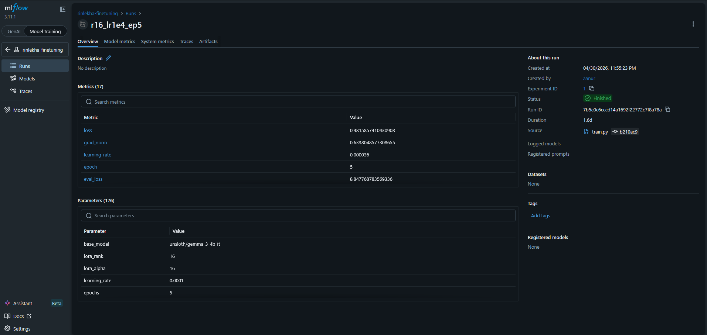
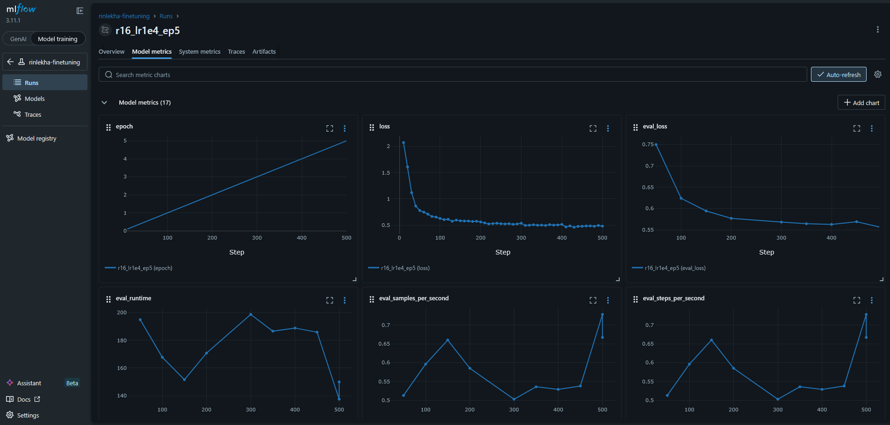

# RinLekha — NBFC Credit Memo Generation via QLoRA Fine-Tuning

A production-style ML pipeline that fine-tunes **Gemma 3 4B** to generate structured credit assessment memos for an Indian NBFC (Non-Banking Financial Company). The model takes a borrower profile as input and produces a fully-formatted, analytically grounded credit memo with an APPROVE / CONDITIONAL APPROVE / DECLINE recommendation.

---

## Problem

Credit analysts at NBFCs spend significant time writing structured memos that follow a rigid institutional format — six mandatory sections, specific risk language constraints, quantified FOIR analysis, and a decision with conditions. The format is learnable; the analysis requires domain grounding. This project tests whether a 4B-parameter model, fine-tuned on ~640 synthetic examples, can reliably produce both.

---

## Pipeline

```
Borrower Profiles → Memo Synthesis → Dataset Builder → QLoRA Fine-Tuning → GGUF Export → Eval → Serving Pipeline → Gradio Demo
      (Phase 1)         (Phase 1)        (Phase 1)         (Phase 2)        (Phase 3)   (Phase 4)    (Phase 5)        (Phase 6)
```

### Phase 1 — Synthetic Dataset (`pipeline/`)
- **800 borrower profiles** generated via stratified sampling across employment type, income band, CIBIL score, and FOIR tier
- Decision labels assigned by a deterministic rule engine (`pipeline/rules.py`) matching real NBFC policy: 55% FOIR ceiling, 620 CIBIL floor, settled-account thresholds
- **Memos synthesised with GPT-4.1-mini** via Ray parallel dispatch; system prompt constrains hedged language, factual accuracy, and strict 6-section format
- QC pass filters hallucinations and format violations; ~640 examples survive → 80/10/10 train/val/test split pushed to HuggingFace Hub

### Phase 2 — QLoRA Fine-Tuning (`training/`)
- Base model: `unsloth/gemma-3-4b-it-unsloth-bnb-4bit` (4-bit NF4 quantisation)
- Alpaca instruction format; loss computed only on the response (via `train_on_responses_only`)
- **3-run ablation** over rank and learning rate:

| Run | Rank | LR | Val Loss |
|-----|------|----|----------|
| run1 | 8 | 2e-4 | 0.847 |
| run2 | 16 | 2e-4 | 0.831 |
| **run3** | **16** | **1e-4** | **0.798** |

- Best adapter (`run3-r16-lr1e4-ep5`) pushed to HuggingFace Hub




### Phase 3 — Serving (`serving/`)
- LoRA adapter merged into base model via PEFT `merge_and_unload()` on Colab T4
- Converted to **GGUF Q8_0** (4.1 GB) via llama.cpp; fits in 6.4 GB VRAM alongside KV cache
- Served with `llama-cpp-python` at **26 tok/s** on RTX 4050 Laptop
- OpenAI-compatible `/v1/completions` + `/health` endpoints

### Phase 4 — Evaluation (`evaluation/`)
- 6 custom DeepEval metrics: 3 rule-based (structural format), 1 count-based (risk flags), 2 LLM-judge (GEval + Faithfulness via GPT-4o-mini)
- Crash-resumable local runner with index-based checkpoint; results logged to MLflow
- **Adversarial suite**: 8 hand-crafted edge cases targeting extreme FOIR, no credit history, delinquency, settled accounts — 5/8 decision accuracy; all DECLINE cases correct
- **Baseline comparison**: RinLekha vs GPT-4o-mini on 30 cases — headline gap is RiskFlagsCount (0.967 vs 0.133), analytical quality tied (GEval 0.861 vs 0.863)

### Phase 5 — Serving Pipeline (`serving/`)
- **LangChain pipeline**: `PromptTemplate | OpenAI (completions) | CreditMemoParser` — uses Alpaca format to match training, not chat endpoint
- **Pydantic output schema**: `CreditMemo` with typed `CreditDecision`, `RiskGrade`; deterministic parser never raises, reports `parse_success` + `parse_errors`
- **Langfuse observability**: `@observe` decorator traces every call with 3 scores (`parse_success`, `structural_compliance`, `decision_extracted`) and metadata (`cibil_band`, `foir_band`, `employment_type`, `loan_purpose`)


### Phase 6 — Gradio Demo (`app/`)
- Borrower profile input form (left panel) with full set of credit parameters
- Generated memo displayed as formatted markdown (right panel)
- Risk Dashboard JSON + Format Compliance JSON shown alongside
- Separate opt-in button for GPT-4o-mini comparison — no external data sent unless explicitly triggered


---

## Results — 100 Test Cases

| Metric | Score | Description |
|--------|-------|-------------|
| StructuralCompliance | **1.000** | All 6 `## SECTION_NAME` headers present and correctly ordered |
| RecommendationFormat | **1.000** | `DECISION / CONDITIONS / RISK GRADE / DECISION AUTHORITY` exact |
| ForbiddenLanguage | **1.000** | No certainty language ("definitely", "guaranteed", "will", etc.) |
| RiskFlagsCount | **0.970** | Bulleted risk section contains 2–4 grounded flags |
| Faithfulness | **0.961** | Figures in memo match the input profile (GPT-4o-mini judge) |
| GEval | **0.832** | Overall analytical quality (GPT-4o-mini judge) |

Structural compliance is perfect across all three decision types:

| Decision | n | GEval | Faithfulness |
|----------|---|-------|--------------|
| APPROVE | 20 | 0.847 | 0.946 |
| CONDITIONAL APPROVE | 51 | 0.829 | 0.969 |
| DECLINE | 25 | 0.824 | 0.955 |

---

## Showcase Cases

### APPROVE — Clean Strong-Credit Profile
*GEval 0.878 · Faithfulness 0.938*

30-year-old self-employed manufacturer, CIBIL 760, FOIR 7.1% → 17.1% post-loan, 3 active loans.

> **## DEBT SERVICEABILITY**
> Current FOIR is low at 7.1%, which increases to an estimated 17.1% post-loan against the policy ceiling of 55%. The proposed EMI of ₹35,211 appears manageable relative to income and existing obligations totaling ₹25,164 per month. This suggests adequate capacity for servicing additional debt under current conditions.
>
> **## RISK FLAGS**
> - Multiple active loans (three), which could indicate higher overall leverage despite low FOIR currently.
> - Relatively short credit vintage of just under four years may limit assessment of long-term repayment behaviour.
>
> **DECISION: APPROVE**

The model flags the 3 active loans without over-penalising them — the FOIR headroom (37 pp below ceiling) is decisive.

---

### CONDITIONAL APPROVE — Serviceable but Delinquency History
*GEval 0.890 · Faithfulness 0.952 — highest GEval in test set*

64-year-old salaried, CIBIL 685, 3 missed payments in 24 months, FOIR 8.2% → 13.1%.

> **## CREDIT BEHAVIOR**
> The borrower has a CIBIL score of 685, placing them in an average credit tier. There have been three missed payments reported over the last 24 months, indicating some recent payment irregularities. The credit vintage is relatively short at 2.3 years with three active loans currently running and no settled accounts recorded.
>
> **## RISK FLAGS**
> - Three missed payments within the past 24 months may indicate potential repayment challenges in the near term.
> - Moderate CIBIL score of 685, which while not below threshold, suggests a moderate credit risk profile.
>
> **DECISION: CONDITIONAL APPROVE**

FOIR at 13.1% keeps this from being a decline; the delinquency history triggers conditions rather than rejection — the same judgment a senior analyst would make.

---

### DECLINE — Excellent Credit Score, Catastrophic FOIR
*GEval 0.886 · Faithfulness 1.000*

58-year-old government employee, 25-year tenure, CIBIL 865, but FOIR 109.3% → 371.3% post-loan.

> **## DEBT SERVICEABILITY**
> The current FOIR stands at 109.3%, which is significantly above the policy ceiling of 55%. After including the proposed EMI of ₹49,406 per month, the post-loan FOIR escalates to an estimated 371.3%, indicating that the borrower's income is insufficient to service all debt obligations comfortably under prevailing conditions.
>
> **## RISK FLAGS**
> - Post-loan FOIR of 371.3% substantially exceeds the policy ceiling of 55%, raising concerns about repayment capacity.
>
> **DECISION: DECLINE**

The model correctly overrides a CIBIL 865 score with a FOIR that is structurally impossible to service. This is the hardest case to get right — a naive model would approve on credit score alone.

---

## Reproducing

```bash
# 1. Start inference server (requires GGUF from HF Hub)
huggingface-cli download a-anurag1024/rinlekha-gguf rinlekha-q8.gguf --local-dir outputs/
bash serving/start_server.sh outputs/rinlekha-q8.gguf

# 2. Run evaluation
export OPENAI_API_KEY=...   # for GEval / Faithfulness judge
python evaluation/run_eval_local.py --no-mlflow

# 3. Run Gradio demo
python app/gradio_app.py
# → http://localhost:7860
```

See `scripts/colab_export_gguf.py` to re-export the GGUF from the adapter if needed.

---

## Stack

| Component | Technology |
|-----------|------------|
| Synthetic data | GPT-4.1-mini + Ray |
| Fine-tuning | Unsloth + TRL (QLoRA, 4-bit NF4) |
| Serving | llama-cpp-python + GGUF Q8_0 |
| Evaluation | DeepEval + GPT-4o-mini judge |
| Experiment tracking | MLflow |
| Production eval | Kubernetes indexed job (kind cluster) |
| Serving pipeline | LangChain + Pydantic |
| Observability | Langfuse |
| Demo | Gradio |
| Adapter + dataset | HuggingFace Hub |
